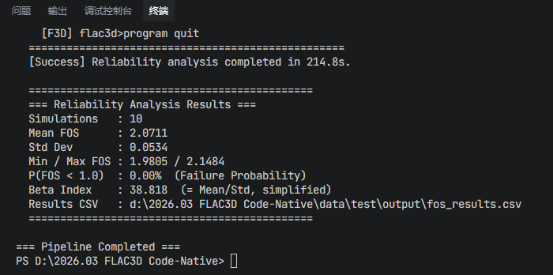

# SlopeRA3D: 三维边坡可靠度自动化分析平台

<p align="center">
  
</p>

**SlopeRA3D** (Slope Reliability Analysis 3D) 是一个完全自动化的岩土工程数值分析工具，实现从"地理高程数据 (TIF)"到"FLAC3D 三维力学计算"再到"随机场 Monte Carlo 可靠度分析"的全流程。该项目通过 Python 脚本驱动，实现了地形预处理、三维建模、多层地层划分、初始地应力平衡、强度折减法 (FOS) 安全系数计算以及基于三维随机场的边坡可靠度评估的无人值守运行。

## 主要特性

### 1. 智能地形处理 (`src/tif_loader.py`)
- 自动加载 GeoTIFF 高程数据，支持降采样 (`DOWNSAMPLE_FACTOR`) 以优化网格数量
- **边缘清理 (Erosion)**: 自动去除 TIF 边缘的噪点和异常高程
- **智能填充 (Extrapolation)**: 使用最近邻扩散算法填充无效值 (NoData)，确保生成完整的矩形计算域

原始 DEM 数据直接生成的地形存在边缘噪点和"垂帘"效应：

<p align="center">
  
</p>
<p align="center"><em>原始 DEM 数据生成的地形文件（边缘存在垂帘状伪影）</em></p>

经过腐蚀去噪 + 最近邻外推填充后，地形完整且干净：

<p align="center">
  
</p>
<p align="center"><em>预处理后生成的地形文件（垂帘消除，边缘平滑外推）</em></p>

### 2. 鲁棒的几何建模 (`src/surface_builder.py`)
- 将高程点阵转换为高质量的 STL 三角网格
- **自动 PCA 对齐**: 使用主成分分析自动将地形长轴对齐 X 轴，并将模型居中到原点
- **垂帘剔除**: 自动识别并剔除由无效值导致的"垂帘"状错误面片

### 3. FLAC3D 全流程自动化 (`src/flac3d_runner.py`)
- 自动生成 FLAC3D 命令流脚本 (`.dat`)
- **混合网格生成**: 采用 "Seed Layer" (种子层) + "Extrude from Topography" (地形挤出) 生成六面体网格
- **多层地层支持**: 通过 `geometry-distance` 按距地形面深度自动分层，支持任意数量的地层
- **全套力学分析**: Mohr-Coulomb 材料赋值 → 边界条件 → 初始地应力平衡 → 位移清零 → FOS 强度折减
- **实时监控**: 调用 FLAC3D 控制台执行计算，实时过滤输出，仅展示关键进度

<p align="center">
  
</p>
<p align="center"><em>多层地层自动划分（基于 geometry-distance 按距地形面深度分层）</em></p>

<p align="center">
  
</p>
<p align="center"><em>FOS 强度折减计算结果（位移云图显示潜在滑动面）</em></p>

### 4. 随机场可靠度分析 (`src/random_field.py` + `src/flac3d_runner.py`)
- **三维随机场生成**: 基于 Cholesky 分解的对数正态随机场，纯 numpy 实现
- **5 种自相关函数 (ACF)**: 单指数、高斯、余弦指数、二阶马尔可夫、三角形
- **c-phi 互相关**: 通过 2x2 Cholesky 矩阵引入粘聚力与摩擦角的互相关性
- **Monte Carlo 循环**: 自动恢复平衡态 → 赋随机属性 → FOS 计算 → 统计汇总
- **结果输出**: 失效概率 P(FOS<1)、可靠度指标 beta、FOS 均值/标准差，结果保存至 CSV

<p align="center">
  
</p>
<p align="center"><em>三维随机场模拟（粘聚力空间分布示例）</em></p>

<p align="center">
  
</p>
<p align="center"><em>Monte Carlo 可靠度分析结果输出</em></p>

## 流水线流程

```
STEP 0: GUI 选择 .tif 文件 → 复制到 data/<Project>/input/
   ↓
STEP 1: TifLoader 加载 GeoTIFF → 降采样 → 腐蚀 → 外推填充 → (x, y, z) 网格
   ↓
STEP 2: SurfaceBuilder 生成三角网格 → 剔除无效面片 → PCA 对齐 → 导出 STL
   ↓
STEP 3: Flac3DRunner 生成 .dat 脚本 → 调用 FLAC3D Console → Elastic 平衡
   ↓                                                      → (可选) FOS 计算
STEP 4: RandomFieldGenerator 生成随机场 → Monte Carlo FOS → 统计汇总
        (RF_ENABLED=True 时执行)
```

## 环境依赖

- **Python**: 3.8+
- **FLAC3D**: 7.0+ (需安装并配置 `flac3d700_console.exe` 路径)
- **Python 库**:
  - `rasterio`: 处理 GeoTIFF 地理数据
  - `trimesh`: 处理 STL 几何网格
  - `numpy`: 数值计算

安装依赖：
```bash
pip install -r requirements.txt
```

## 快速开始

### 1. 配置参数
打开 `config.py`，根据实际情况修改：

```python
# FLAC3D 可执行文件路径 (必须修改为你的真实路径)
FLAC3D_CONSOLE_PATH = r"C:\Program Files\Itasca\FLAC3D700\exe64\flac3d700_console.exe"

# 网格尺寸
MESH_RES_X = 5
MESH_RES_Y = 5
MESH_RES_Z = 5

# 地层结构 (从上往下定义)
LAYERS = [
    {"name": "top_soil",      "thickness": 2.0,  "mat_props": {...}},
    {"name": "weathered_rock", "thickness": 5.0,  "mat_props": {...}},
    {"name": "bedrock",        "thickness": None, "mat_props": {...}},  # None = 延伸到底部
]

# 随机场可靠度分析
RF_ENABLED = True       # 是否启用 Monte Carlo 可靠度分析
RF_NSIM    = 10         # 模拟次数
RF_ACF     = 1          # 自相关函数类型 (1~5)
RF_RXY     = -0.5       # c-φ 互相关系数
```

### 2. 运行流水线
```bash
python main.py
```

程序启动后弹出文件选择框，选择 GeoTIFF 文件：

<p align="center">
  
</p>
<p align="center"><em>GUI 文件选择对话框</em></p>

输入项目名称后自动执行全流程。

### 3. 查看结果
结果保存在 `data/<Project_Name>/output/`：

| 文件 | 说明 |
|------|------|
| `terrain_surface.stl` | 生成的地形 STL 模型 |
| `run_analysis.dat` | 自动生成的 FLAC3D 分析脚本 |
| `model_balanced.sav` | 初始平衡后的模型状态 |
| `FOS-*.sav` | FOS 计算结果模型文件 |
| `rf_monte_carlo.py` | Monte Carlo 分析脚本 (RF_ENABLED=True) |
| `run_reliability.dat` | 可靠度分析 FLAC3D 脚本 |
| `fos_results.csv` | Monte Carlo FOS 结果统计 |

## 项目结构

```
SlopeRA3D/
├── config.py                 # 全局配置 (路径、网格、地层、随机场参数)
├── main.py                   # 主程序入口 (GUI 文件选择 + 四步流水线)
├── requirements.txt          # Python 依赖列表
├── debug_flac3d_script.py    # FLAC3D GUI 内手动调试脚本
├── raw_tif_to_stl.py         # 原始 TIF 转 STL 对比工具
├── test_data_gen.py          # 测试数据生成器
├── fig/                      # README 插图
├── data/
│   └── <Project_Name>/
│       ├── input/            # .tif 输入文件 (自动复制)
│       └── output/           # STL、脚本、计算结果
└── src/
    ├── tif_loader.py         # TIF 数据加载与预处理
    ├── surface_builder.py    # STL 生成与几何变换 (PCA)
    ├── flac3d_runner.py      # FLAC3D 脚本生成、执行与可靠度分析调度
    └── random_field.py       # 三维随机场生成器 (纯 numpy)
```

## 注意事项

1. **FLAC3D 路径**: 请在 `config.py` 中正确设置 `FLAC3D_CONSOLE_PATH`
2. **坐标系**: 程序会自动将地形居中并 PCA 旋转。如需保留原始坐标系，修改 `src/surface_builder.py` 禁用 PCA 对齐
3. **网格规模**: 地形较大时，适当增大 `MESH_RES_X/Y` 或 `DOWNSAMPLE_FACTOR` 以控制计算量
4. **FLAC3D 内置 NumPy**: FLAC3D 7.0 内置的 NumPy 版本较旧，随机场模块已做兼容处理

## 调试

使用 `debug_flac3d_script.py` 在 FLAC3D GUI 中逐步排查：
1. 打开 FLAC3D 软件 (GUI)
2. 菜单栏 `Tools -> Python -> Open Python Script...`
3. 选择并运行 `debug_flac3d_script.py`
