# SlopeRA3D: 三维边坡自动建模与可靠度分析

<p align="center">
  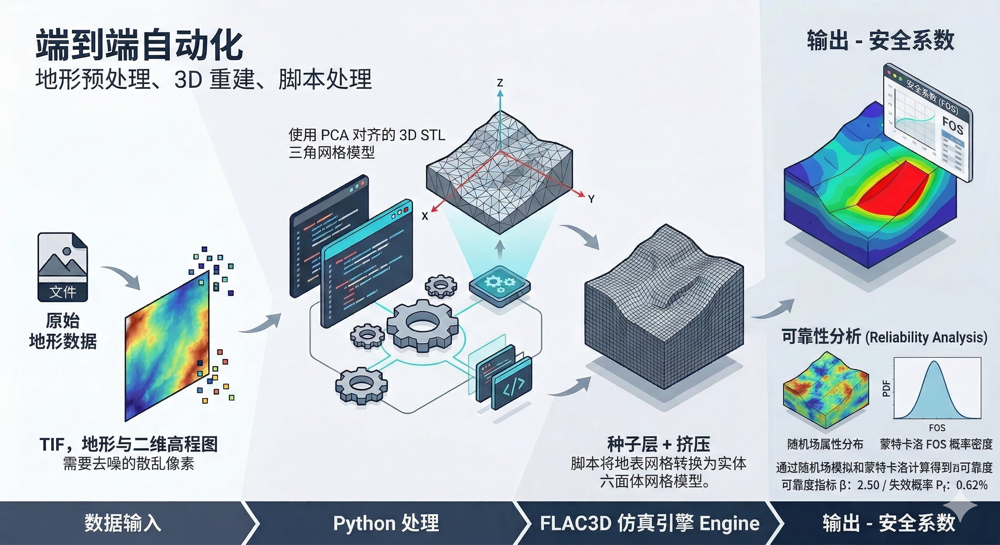
</p>

**SlopeRA3D** 是一个面向边坡工程的自动化数值分析工具链，实现从 `GeoTIFF/DEM` 到 `FLAC3D` 的三维地质体建模、结构体融合建模、安全系数计算以及随机场可靠度分析。当前版本已经同时支持：

- 纯地质体自动建模
- 地质体 + 支护结构体建模（Path A-支持结构 pile/cable/beam 单元，Path B-支持实体 zone 单元）
- FOS 安全系数计算
- 基于 Monte Carlo 的随机场可靠度分析

## 1. 当前能力

### 1. 地形预处理与地质体建模

- 自动读取 GeoTIFF 高程数据，支持降采样、边缘腐蚀与 NoData 外推填充
- 自动生成地形 STL，并通过 PCA 旋转和模型居中统一坐标系
- 支持多层地层自动划分，并写入 FLAC3D 材料与边界条件脚本

<table align="center">
  <tr>
    <td align="center">
      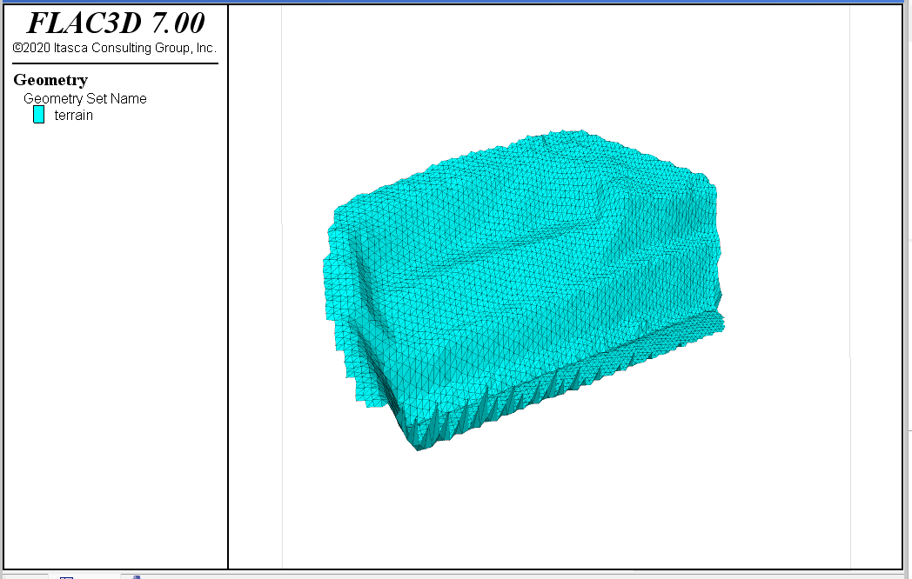<br>
      <em>原始 DEM 直接建模时的边缘伪影</em>
    </td>
    <td align="center">
      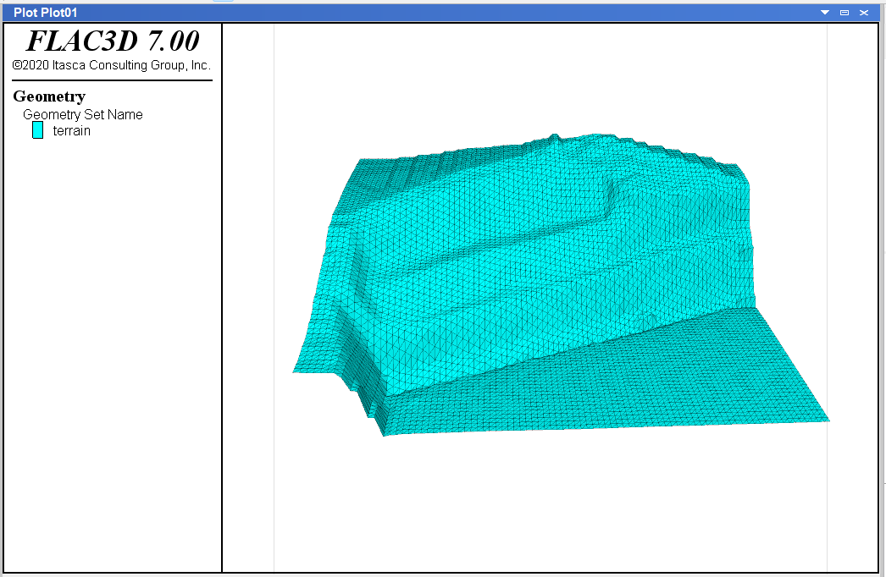<br>
      <em>预处理后的 DEM 建模效果</em>
    </td>
  </tr>
</table>

### 2. Path A：FLAC3D Structure 元素路线

- 使用 `structure pile / cable / beam` 在 FLAC3D 内直接建立结构体
- 支持 pile、beam、cable 三类对象的 schema 解析与几何校验
- 适合需要显式结构单元、锚索张拉和后续结构响应分析的场景

<p align="center">
  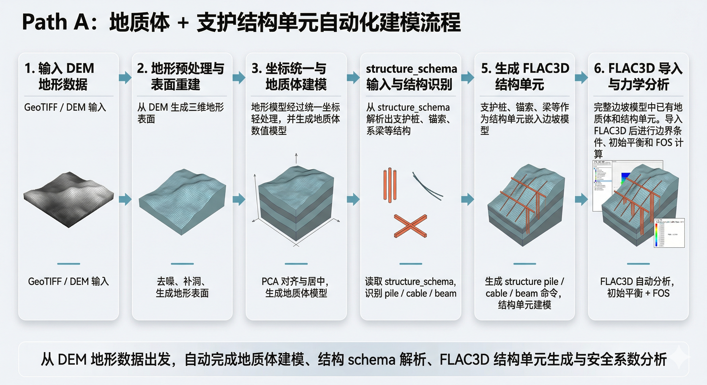
</p>
<p align="center"><em>Path A 自动化建模流程图</em></p>

<p align="center">
  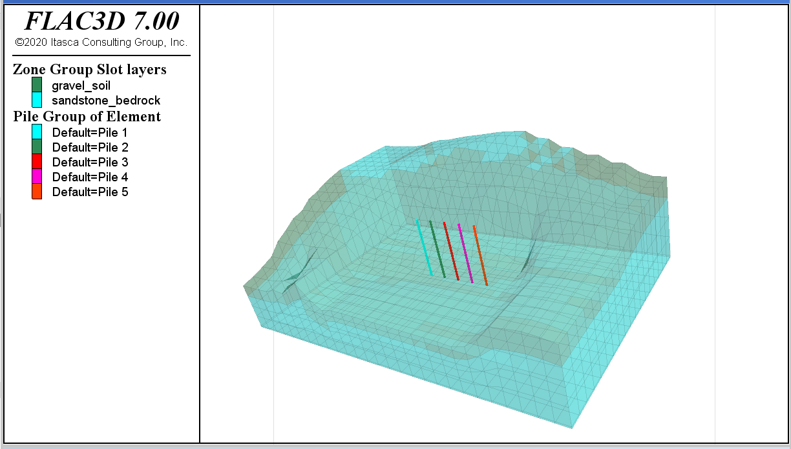
</p>
<p align="center"><em>Path A：地质体 + FLAC3D structure 元素融合建模</em></p>

### 3. Path B：Gmsh 实体 zone 路线

- 将结构体视作可实体化的三维几何，与地质体共同生成 tet 体网格
- 当前支持 `box`、`cylinder`、`polyline_extrude` 等可实体化 primitive
- 结构体与地质体共享统一坐标系，自动导出 `.f3grid` 并导入 FLAC3D
- 已支持地质体与支护桩的自动融合建模、单元分组与材料赋值

<p align="center">
  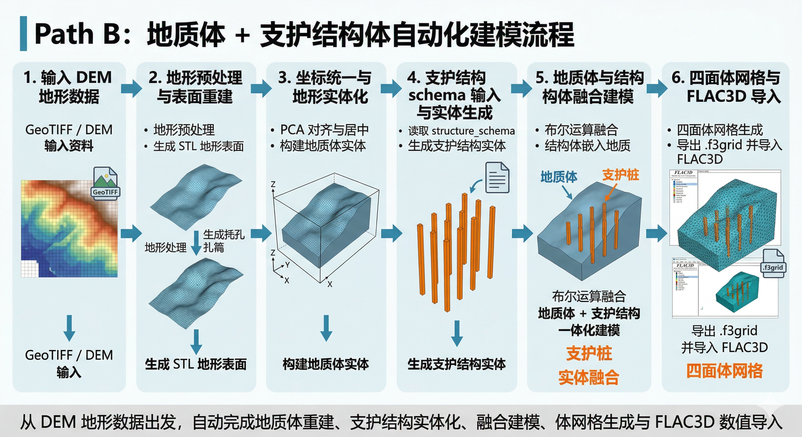
</p>
<p align="center"><em>Path B 自动化建模流程图</em></p>

<table align="center">
  <tr>
    <td align="center">
      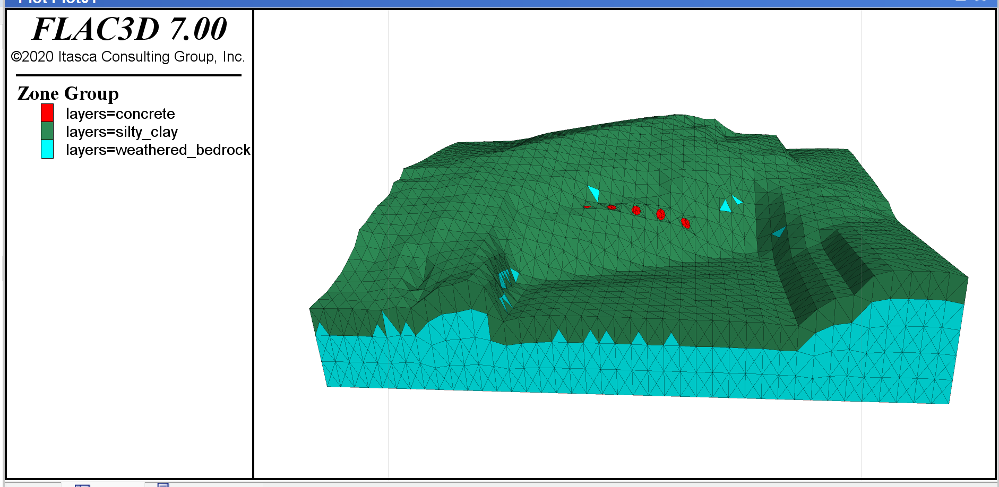<br>
      <em>Path B：地质体 + 实体支护桩体网格建模</em>
    </td>
    <td align="center">
      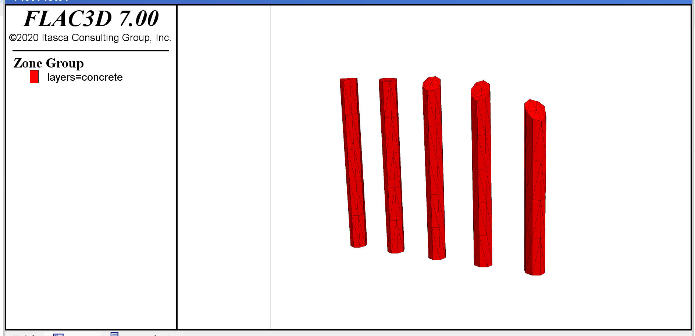<br>
      <em>Path B：支护桩建模效果</em>
    </td>
  </tr>
</table>

### 4. FOS 与可靠度分析

- 自动执行初始平衡、位移清零、强度折减安全系数分析
- 支持三维随机场材料参数生成与 Monte Carlo 可靠度统计
- 输出 `FOS-*.sav`、`fos_results.csv` 等结果文件

<table align="center">
  <tr>
    <td align="center">
      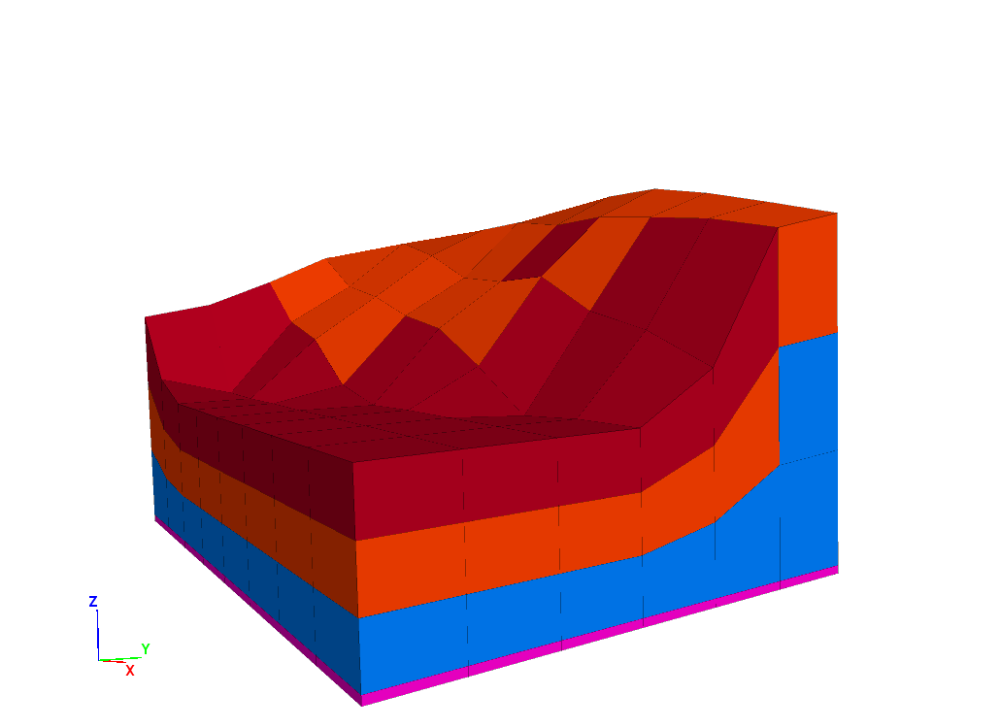<br>
      <em>自动分层与材料赋值示意</em>
    </td>
    <td align="center">
      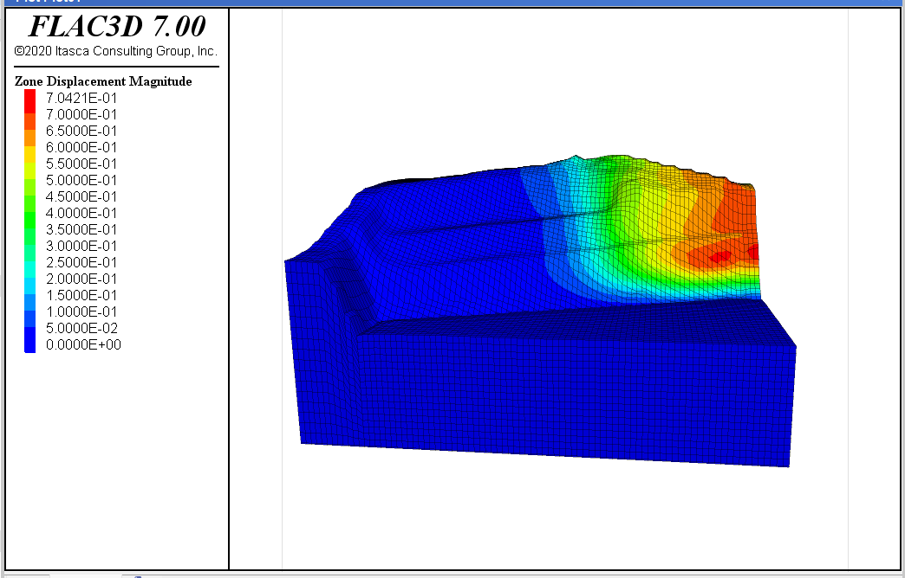<br>
      <em>安全系数分析结果示意</em>
    </td>
    <td align="center">
      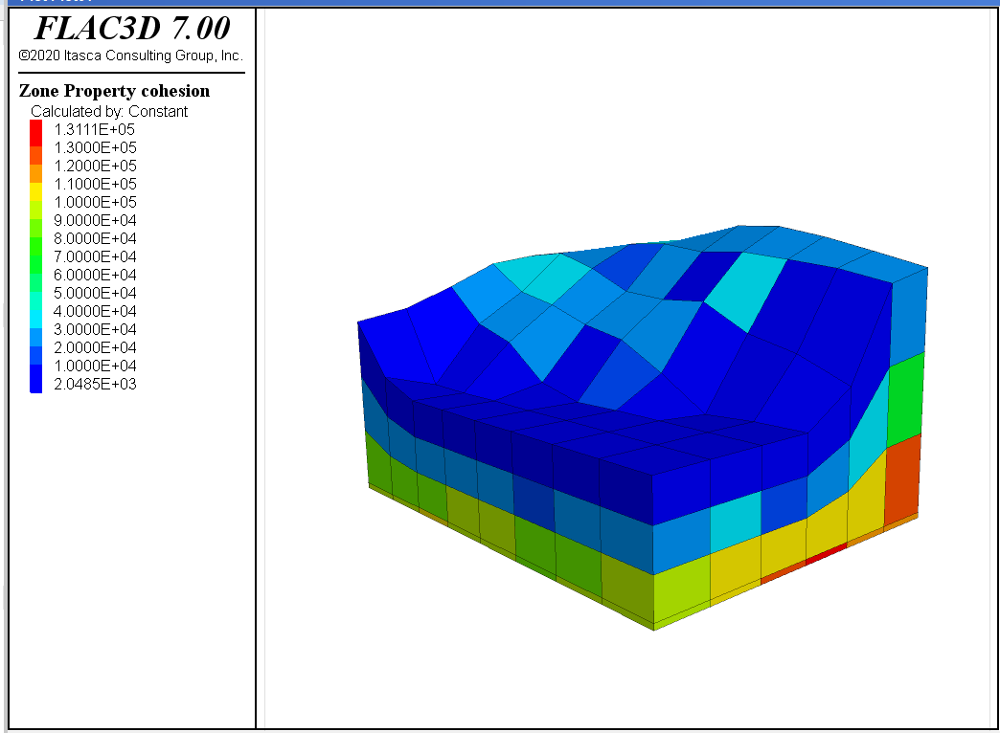<br>
      <em>可靠度分析中的随机场示意</em>
    </td>
  </tr>
</table>

## 2. 流程概览

```text
STEP 1  读取 TIF / DEM
  -> 降采样、边缘清理、NoData 外推

STEP 2  生成地形几何
  -> STL 三角网格
  -> PCA 对齐与模型居中

STEP 2.5 结构体处理（可选）
  -> Path A: 生成 FLAC3D structure 命令
  -> Path B: Gmsh 实体布尔 + tet 网格 + .f3grid

STEP 3  FLAC3D 力学分析
  -> 材料赋值
  -> 边界条件
  -> 初始平衡
  -> FOS 计算

STEP 4  可靠度分析（可选）
  -> 随机场
  -> Monte Carlo
  -> 统计汇总
```

## 3. 环境依赖

- Python 3.10+
- FLAC3D 7.0+
- Gmsh Python API
- 关键 Python 库：
  - `numpy`
  - `rasterio`
  - `trimesh`
  - `scipy`

安装依赖：

```bash
pip install -r requirements.txt
```

## 4. 快速开始

### 1. 配置 `config.py`

最少需要先确认以下参数：

```python
FLAC3D_CONSOLE_PATH = r"C:\Program Files\Itasca\FLAC3D700\exe64\flac3d700_console.exe"
MAIN_TIF_PATH = r"...\data\<project>\input\DEM.tif"
MAIN_PROJECT_NAME = "<project>"
```

### 2. 运行主程序

```bash
python main.py
```

如果未在配置中固定输入 DEM，也可以通过 GUI 选择文件：

<p align="center">
  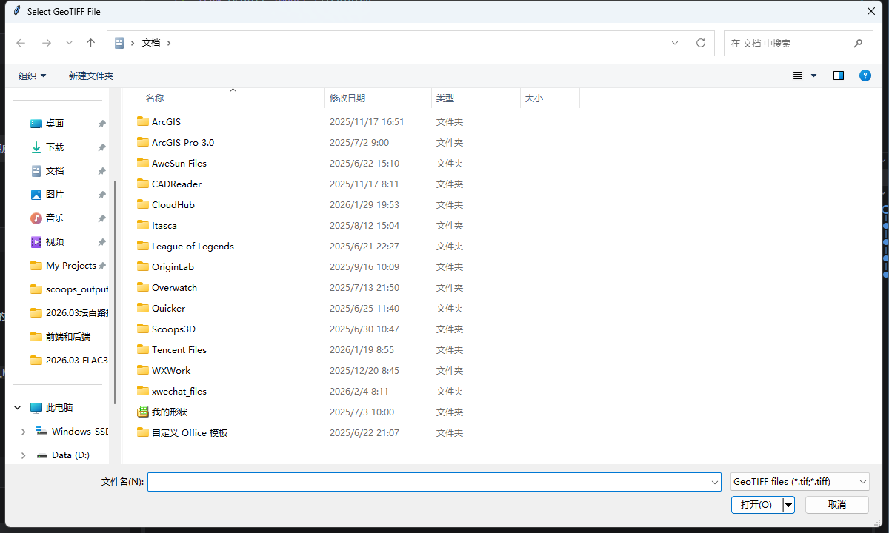
</p>
<p align="center"><em>选择输入 DEM 文件</em></p>

### 3. 查看输出

结果默认位于 `data/<Project_Name>/output/`，常见文件包括：

| 文件                    | 说明               |
| --------------------- | ---------------- |
| `terrain_surface.stl` | 地形表面 STL         |
| `run_analysis.dat`    | FLAC3D 主分析脚本     |
| `model_mesh.f3grid`   | Path B 体网格导出文件   |
| `model_balanced.sav`  | 初始平衡模型           |
| `FOS-*.sav`           | FOS 过程与结果文件      |
| `run_reliability.dat` | 可靠度分析脚本          |
| `rf_monte_carlo.py`   | Monte Carlo 驱动脚本 |
| `fos_results.csv`     | 可靠度统计结果          |

## 5. 参数配置说明

这一节重点区分三种建模模式的参数入口与注意事项。

### A. 普适性参数

以下参数无论是否启用结构体，都建议优先检查：

| 参数                    | 作用                | 建议                 |
| --------------------- | ----------------- | ------------------ |
| `FLAC3D_CONSOLE_PATH` | FLAC3D Console 路径 | 必须有效               |
| `MAIN_TIF_PATH`       | 当前项目 DEM 路径       | 指向 `input/DEM.tif` |
| `MAIN_PROJECT_NAME`   | 输出目录名             | 与项目保持一致            |
| `DOWNSAMPLE_FACTOR`   | DEM 降采样因子         | 大模型先调大             |
| `Z_SCALE`             | 高程缩放              | 一般保持 `1.0`         |
| `LAYERS`              | 地层厚度与材料参数         | 从上到下定义             |
| `MODEL_BOT_OFFSET`    | 模型底部延伸深度          | 需保证底层完整            |
| `GRAVITY_Z`           | 重力加速度             | 通常为 `-9.81`        |
| `SOLVE_ELASTIC_RATIO` | 初始平衡收敛标准          | 建议先保持默认            |
| `SOLVE_FOS_RATIO`     | FOS 计算收敛标准        | 建议先保持默认            |

`LAYERS` 的定义方式：

```python
LAYERS = [
    {
        "name": "silty_clay",
        "thickness": 3.0,
        "mat_props": {
            "density": 1900.0,
            "young": 3e7,
            "poisson": 0.35,
            "cohesion": 18000.0,
            "friction": 15.0,
            "tension": 0.0,
        },
    },
    {
        "name": "weathered_bedrock",
        "thickness": None,
        "mat_props": {
            "density": 2250.0,
            "young": 1.5e9,
            "poisson": 0.28,
            "cohesion": 250000.0,
            "friction": 35.0,
            "tension": 40000.0,
        },
    },
]
```

### B. 纯地质体建模

适用条件：

- `SSI_ENABLED = False`

关键参数：

| 参数                   | 作用                   |
| -------------------- | -------------------- |
| `MESH_RES_X / Y / Z` | Path A/纯地质体六面体种子网格尺寸 |
| `MODEL_BOT_OFFSET`   | 决定地质体向下延伸深度          |
| `DOWNSAMPLE_FACTOR`  | 控制 STL 和几何规模         |

注意事项：

- 纯地质体路线不需要 `structure_schema`
- 网格规模主要由 `MESH_RES_X/Y/Z` 和 `DOWNSAMPLE_FACTOR` 控制

### C. 地质体 + 结构体 Path A

适用条件：

```python
SSI_ENABLED = True
SSI_PATH = 'A'
```

Path A 的关键输入是 `structure_schema.json`，由 `schema_parser.py` 解析，并由 `structure_elements.py` 转为 FLAC3D structure 命令。

关键参数：

| 参数                            | 作用                                                          |
| ----------------------------- | ----------------------------------------------------------- |
| `SSI_SCHEMA_PATH`             | 结构 schema 路径；为 `None` 时默认查找项目 `input/structure_schema.json` |
| `SSI_STRICT`                  | 是否严格执行 schema 校验                                            |
| `STRUCTURE_ELEMENTS['pile']`  | pile 的弹性模量、惯性矩、耦合刚度、离散段数                                    |
| `STRUCTURE_ELEMENTS['beam']`  | beam 的截面面积、惯性矩、离散段数                                         |
| `STRUCTURE_ELEMENTS['cable']` | cable 的截面面积、预应力、离散段数                                        |

Path A 使用建议：

- pile 推荐使用 `cylinder`
- beam / cable 推荐使用 `line_segment` 或 `member`
- 当前已支持几何校验，建议保留 `SSI_STRICT = True`
- 若包含 pretension cable，建议先按现有默认流程执行，不要随意修改求解顺序

### D. 地质体 + 结构体 Path B

适用条件：

```python
SSI_ENABLED = True
SSI_PATH = 'B'
```

Path B 当前已经支持“地质体 + 实体支护桩”的自动化建模，但与 Path A 的适用对象不同。

支持范围：

- 支持：`box`、`cylinder`、`polyline_extrude`
- 不支持：`line_segment`、`member`
- 也就是 Path B 当前**不直接支持 1D beam/cable**，这类对象应优先走 Path A

Path B 关键参数：

| 参数                             | 作用                   | 当前建议          |
| ------------------------------ | -------------------- | ------------- |
| `SSI_SCHEMA_PATH`              | Path B 结构 schema     | 仅保留可实体化对象     |
| `GMSH_MESH_SIZE_TERRAIN`       | 地质体目标网格尺寸            | 大模型先调粗        |
| `GMSH_MESH_SIZE_STRUCTURE`     | 结构体附近最小网格尺寸          | 先比 terrain 略细 |
| `GMSH_STRUCTURE_DIST_MIN`      | 结构表面最细网格保持距离         | 一般取 `0.0`     |
| `GMSH_STRUCTURE_DIST_MAX`      | 结构影响范围               | 先小后大调试        |
| `GMSH_TERRAIN_GRID_MAX_POINTS` | terrain solid 最大高程点数 | 控制 Gmsh 复杂度   |
| `GMSH_OPTIMIZE_QUALITY`        | 是否做网格优化              | 调试期可先关闭       |

Path B 关键注意事项：

- terrain 与 structure 必须使用**同一套 PCA/居中坐标系**
- Path B 当前导出的是 **tet 四面体体网格**，不是六面体网格
- 若出现几何布尔不稳，可优先：
  - 减少结构数量
  - 增大 `DOWNSAMPLE_FACTOR`
  - 增大 `GMSH_MESH_SIZE_TERRAIN`
  - 缩小 `GMSH_STRUCTURE_DIST_MAX`

## 6. 结构 schema 说明

`SSI_SCHEMA_PATH` 指向的结构文件通常包含三部分：

- `primitives`
- `operations`
- `outputs.final_objects`

示意：

```json
{
  "primitives": [
    {
      "id": "pile_1",
      "type": "cylinder",
      "center": [380933.0, 2835468.0, 335.0],
      "radius": 0.75,
      "height": 15.0
    }
  ],
  "operations": [],
  "outputs": {
    "final_objects": ["pile_1"]
  }
}
```

说明：

- Path A 可使用包含 pile / beam / cable 的混合 schema
- Path B 应使用仅包含可实体化对象的 schema

## 7. Structure Schema 固定格式

`structure_schema` 应被视作“上游结构识别/大模型生成模块”和“本程序自动建模模块”之间的固定接口协议。无论 schema 是人工编写，还是由大模型读取三视图、设计说明、工程表格后自动生成，都建议严格遵守同一套固定格式。

### 顶层结构

推荐并约束为以下四个顶层字段：

- `meta`
- `primitives`
- `operations`
- `outputs`

最小骨架如下：

```json
{
  "meta": {
    "unit": "m",
    "description": "example structure schema"
  },
  "primitives": [],
  "operations": [],
  "outputs": {
    "final_objects": []
  }
}
```

### 字段约束

| 字段                      | 约束                                   |
| ----------------------- | ------------------------------------ |
| `meta.unit`             | 当前建议固定为 `m`                          |
| `primitives[].id`       | 必须唯一，且供 `final_objects` 引用           |
| `primitives[].type`     | 必须来自受支持的 primitive 类型集合              |
| 坐标字段                    | 一律使用三维坐标数组 `[x, y, z]`               |
| 尺寸字段                    | `radius`、`height`、`thickness` 等必须为正数 |
| `outputs.final_objects` | 必须引用前面已定义的 primitive 或 operation 结果  |

### 当前支持的 primitive

| primitive          | 典型字段                       | Path A | Path B |
| ------------------ | -------------------------- | ------ | ------ |
| `cylinder`         | `center`、`radius`、`height` | 支持     | 支持     |
| `box`              | `origin`、`size`            | 可扩展    | 支持     |
| `polyline_extrude` | `profile`、`z0`、`height`    | 不推荐    | 支持     |
| `line_segment`     | `start`、`end`、`radius`     | 支持     | 不支持    |
| `member`           | `nodes`、`section` 等        | 支持     | 不支持    |

### Path A / Path B 的 schema 子集

- **Path A**
  - 适合 `pile / cable / beam`
  - 支持 1D 结构语义对象
  - 可使用 `line_segment`、`member`、`cylinder`
- **Path B**
  - 适合实体支护结构建模
  - 当前只接受可实体化对象
  - 不应包含 `line_segment`、`member`

### 示例 1：Path A 混合结构

```json
{
  "meta": {
    "unit": "m",
    "description": "Path A example"
  },
  "primitives": [
    {
      "id": "pile_1",
      "type": "cylinder",
      "center": [380933.0, 2835468.0, 335.0],
      "radius": 0.75,
      "height": 15.0
    },
    {
      "id": "anchor_1",
      "type": "line_segment",
      "start": [380940.0, 2835468.0, 346.0],
      "end": [380955.0, 2835465.0, 341.0],
      "radius": 0.06
    }
  ],
  "operations": [],
  "outputs": {
    "final_objects": ["pile_1", "anchor_1"]
  }
}
```

### 示例 2：Path B 实体结构

```json
{
  "meta": {
    "unit": "m",
    "description": "Path B example"
  },
  "primitives": [
    {
      "id": "pile_1",
      "type": "cylinder",
      "center": [380933.0, 2835468.0, 335.0],
      "radius": 0.75,
      "height": 15.0
    }
  ],
  "operations": [],
  "outputs": {
    "final_objects": ["pile_1"]
  }
}
```

### 生成建议

如果后续由大模型自动生成 `structure_schema`，建议遵循以下规则：

- 先判定目标建模路线是 Path A 还是 Path B
- Path A 优先生成结构语义完整的 schema
- Path B 优先生成可实体化的 primitive，避免输出 1D 构件
- 不要省略单位、尺寸和最终输出对象
- 不要引用未定义的 `id`

更详细的接口规范、字段说明与建议约束见：

- [docs/structure\_schema\_spec.md](file:///d:/2026.03%20FLAC3D%20Code-Native/docs/structure_schema_spec.md)

## 8. 可靠度分析参数

当需要进行 Monte Carlo 可靠度分析时，重点关注：

| 参数                      | 作用             |
| ----------------------- | -------------- |
| `RF_ENABLED`            | 是否启用可靠度分析      |
| `RF_NSIM`               | Monte Carlo 次数 |
| `RF_ACF`                | 自相关函数类型        |
| `RF_RXY`                | `c-phi` 互相关系数  |
| `RF_LX / RF_LY / RF_LZ` | 相关长度           |

建议：

- 先在确定性 FOS 跑通后，再打开 `RF_ENABLED`
- 可靠度分析项目建议单独使用项目目录，避免输出文件相互覆盖

## 9. 项目结构

```text
SlopeRA3D/
├── config.py
├── main.py
├── README.md
├── requirements.txt
├── fig/
├── data/
│   └── <project>/
│       ├── input/
│       │   ├── DEM.tif
│       │   └── structure_schema.json
│       └── output/
└── src/
    ├── tif_loader.py
    ├── surface_builder.py
    ├── schema_parser.py
    ├── structure_elements.py
    ├── path_a_geometry.py
    ├── path_b_geometry.py
    ├── gmsh_mesher.py
    ├── mesh_converter.py
    ├── flac3d_runner.py
    └── random_field.py
```

## 10. 调试建议

推荐按以下顺序排查问题：

1. 先确认 DEM 预处理与 STL 是否正确
2. 再确认结构 schema 是否能通过对应路径校验
3. Path A 优先检查 structure 命令生成结果
4. Path B 优先检查 `.f3grid` 是否能单独导入 FLAC3D
5. 最后再检查边界条件、材料赋值与 FOS 求解

## 11. 注意事项

1. `config.py` 中的示例参数不一定适合所有项目，尤其是大地形、多桩和可靠度分析场景
2. Path A 和 Path B 的结构 schema 适用范围不同，不能直接混用
3. Path B 当前路线以“可稳定跑通”为优先，建议先用粗网格建立 baseline，再逐步加细
4. 运行过程中生成的大量 `.sav`、`.dat`、`.f3grid`、日志与调试文件已统一建议忽略，不建议纳入版本控制
